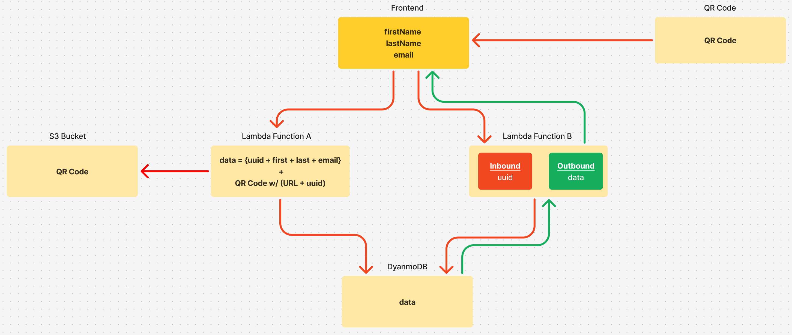

# Project Description
This project is a web application that allows users to generate unique QR codes linked to user profiles. Upon scanning a QR code, users are redirected to a profile page that displays their submitted information (First Name, Last Name, and Email). The application integrates with an API for user data retrieval and utilizes Amazon Web Services (AWS) for backend storage, including DynamoDB for database management and Lambda for serverless processing.

## Features

-    QR Code Generation: Unique QR codes are generated for each user, containing a user ID that links to their profile data.

-    QR Code Scanning: Users can scan the QR code to retrieve the corresponding user data from the backend API.

-    Dynamic User Profile Page: After scanning the QR code, users are redirected to a profile page displaying their personal details, such as first name, last name, and email address.

-    Frontend: Built with React for a seamless and responsive user interface.

-    Backend: AWS Lambda functions are used to fetch user data from a DynamoDB table based on the user ID provided by the QR code scan.

-    Hosting: The application is hosted on AWS with an API Gateway routing requests to the backend.

## Tech Stack

-    Frontend: React, React Router

-    Backend: AWS Lambda, DynamoDB, AWS API Gateway

-    Hosting: AWS (Lambda, DynamoDB, API Gateway, S3)

## Features to be added
1. Error page on 404 response 
2. QR Code to render on registration
3. Accessibility 
4. Edit user info
5. Extra error handling on the backend
6. Support for different backend responses

## Project Infrastructure

